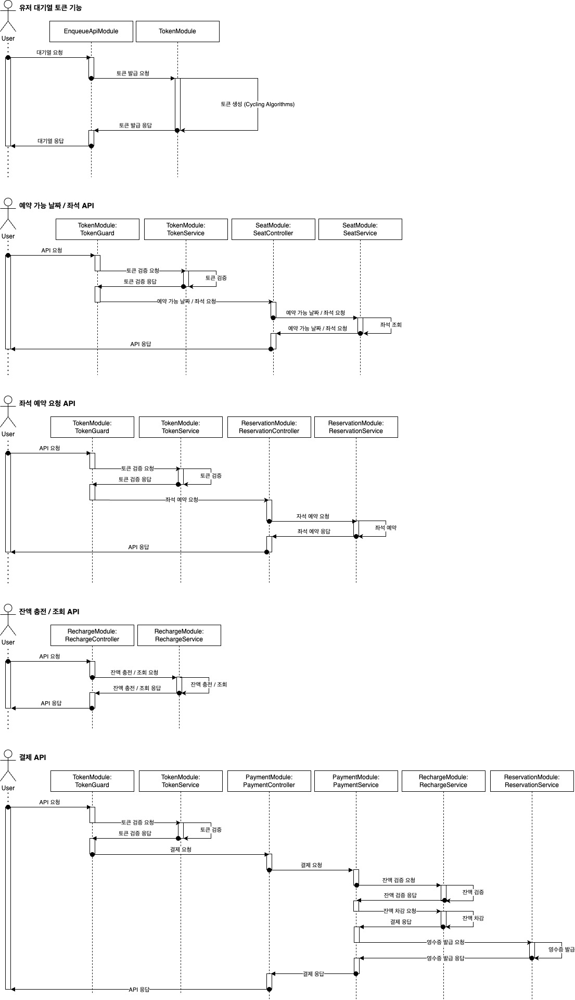

# 항해플러스 백엔드 4기 서버 구축 시나리오 "콘서트 예약"

- `콘서트 예약 서비스`를 구현해 봅니다.
- 대기열 시스템을 구축하고, 예약 서비스는 작업가능한 유저만 수행할 수 있도록 해야합니다.
- 좌석 예약 요청시에, 결제가 이루어지지 않더라도 일정 시간동안 다른 유저가 해당 좌석에 접근할 수 없도록 합니다.

## Requirements

- 아래 5가지 API 를 구현합니다.
    - 유저 토큰 발급 API
    - 예약 가능 날짜 / 좌석 API
    - 좌석 예약 요청 API
    - 잔액 충전 / 조회 API
    - 결제 API
- 각 기능 및 제약사항에 대해 단위 테스트를 반드시 하나 이상 작성하도록 합니다.
- 다수의 인스턴스로 어플리케이션이 동작하더라도 기능에 문제가 없도록 작성하도록 합니다.
- 동시성 이슈를 고려하여 구현합니다.
- 대기열 개념을 고려해 구현합니다.

## API 개요

1️⃣`주요` 유저 대기열 토큰 기능

- 서비스를 이용할 토큰을 발급받는 API를 작성합니다.
- 토큰은 유저의 UUID 와 해당 유저의 대기열을 관리할 수 있는 정보 ( 대기 순서 or 잔여 시간 등 ) 를 포함합니다.
- 이후 모든 API 는 위 토큰을 이용해 대기열 검증을 통과해야 이용 가능합니다.

> 기본적으로 폴링으로 본인의 대기열을 확인한다고 가정하며, 다른 방안 또한 고려해보고 구현해 볼 수 있습니다.

2️⃣`기본` 예약 가능 날짜 / 좌석 API

- 예약가능한 날짜와 해당 날짜의 좌석을 조회하는 API 를 각각 작성합니다.
- 예약 가능한 날짜 목록을 조회할 수 있습니다.
- 날짜 정보를 입력받아 예약가능한 좌석정보를 조회할 수 있습니다.

> 좌석 정보는 1 ~ 50 까지의 좌석번호로 관리됩니다.

3️⃣`주요` 좌석 예약 요청 API

- 날짜와 좌석 정보를 입력받아 좌석을 예약 처리하는 API 를 작성합니다.
- 좌석 예약과 동시에 해당 좌석은 그 유저에게 약 5분간 임시 배정됩니다. ( 시간은 정책에 따라 자율적으로 정의합니다. )
- 배정 시간 내에 결제가 완료되지 않았다면 좌석에 대한 임시 배정은 해제되어야 합니다.
- 배정 시간 내에는 다른 사용자는 예약할 수 없어야 합니다.

4️⃣`기본`  잔액 충전 / 조회 API

- 결제에 사용될 금액을 API 를 통해 충전하는 API 를 작성합니다.
- 사용자 식별자 및 충전할 금액을 받아 잔액을 충전합니다.
- 사용자 식별자를 통해 해당 사용자의 잔액을 조회합니다.

5️⃣`주요` 결제 API

- 결제 처리하고 결제 내역을 생성하는 API 를 작성합니다.
- 결제가 완료되면 해당 좌석의 소유권을 유저에게 배정하고 대기열 토큰을 만료시킵니다.

<aside>
💡 KEY POINT

</aside>

- 유저간 대기열을 요청 순서대로 정확하게 제공할 방법을 고민해 봅니다.
- 동시에 여러 사용자가 예약 요청을 했을 때, 좌석이 중복으로 배정 가능하지 않도록 합니다.

## Milestone

- 3주차 (설계 & Mock API)
    - SPRINT 1 [[상세보기](https://github.com/JeHwanYoo/hpb-concert/milestone/1)]
    - SPRINT 2 [[상세보기](https://github.com/JeHwanYoo/hpb-concert/milestone/2)]
- 4주차 (기능 구현)
    - SPRINT 3 [[상세보기](https://github.com/JeHwanYoo/hpb-concert/milestone/3)]
    - SPRINT 4 [상세보기](https://github.com/JeHwanYoo/hpb-concert/milestone/4)
- 5주차 (기능 고도화)
    - SPRINT 5 [[상세보기](https://github.com/JeHwanYoo/hpb-concert/milestone/5)]
    - SPRINT 6 [[상세보기](https://github.com/JeHwanYoo/hpb-concert/milestone/6)]

간트차트 (작성 예정): https://github.com/users/JeHwanYoo/projects/1/views/2

## Sequence Diagram



## API Specifications

- 유저 토큰: 요구사항에 따라, 유저 토큰은 DB 데이터를 기반으로 임의로 생성 (로그인 ❌)
- 대기열 토큰: 대기열을 이용한 API 토큰

### 대기열 요청

- Endpoint: POST /enqueues
- Request
    - Authorization: 유저 토큰
- Response
    - 200: OK. 대기열 토큰 반환
    - 400: Bad Request
    - 401: Unauthorized

- 🚧 고려사항, `SSE`, `소켓` 등을 이용한 실시간 통신

## 예약 가능 날짜 / 좌석 API

- Endpoint: GET /concerts/:concert_id/seats
- Response
    - 200: Ok. 예약 가능 날짜 / 좌석

## 좌석 예약 요청 API

- Endpoint: POST /concerts/:concert_id/seats/:seat_no/reservations
- Request
    - Authorization: 대기열 토큰
- Response
    - 200: OK. 예약 완료
    - 400: Bad Request
    - 401: Unauthorized
    - 403: Forbidden

## 잔액 충전 / 조회 API

- Endpoint: [GET | PATCH] /charges
- Request
    - Authorization: 유저 토큰
- Response
    - 200: OK. 충전 / 조회 완료
    - 400: Bad Request
    - 401: Unauthorized
    - 403: Forbidden

## 결제 API

- Endpoint: POST /concerts/:concert_id/seats/:seat_no/payments
- Request
    - Authorization: 대기열 토큰
- Response
    - 200: OK. 결제 완료
    - 400: Bad Request
    - 401: Unauthorized
    - 403: Forbidden

## ERD


> Todo: Swagger Mock API 로 제공 예정

## 기술 스택

- Main Framework: NestJS (Fastify + SWC)
- Test Framework: Vitest & testcontainer (integrated, e2e...)
- DBMS: Postgres + Prisma

## OpenAPI


## 디렉토리 구조

- `src/apis/*`: API Controller, UseCase Layers
- `src/domain*`: Business(Service) Layers
- `src/infra/*`: Infrastructure Layers
    - `prisma`: Prisma Connection
    - `redis`: Redis Connection
    - `repositories/*`: The implementations of repository interfaces
- `src/shared/*`: 공통파일
    - `src/shared/transaction`: 트랜잭션 공통 인터페이스 모듈

- `**/*.spec.ts`: 유닛 테스트 & 통합 테스트
    - 레포지토리 구현은 실제 DB와 붙여서 테스트하는 것이 의미 있다 판단하여, 통합 테스트로 구현하였음.
- `**/*.e2e-spec.ts`: E2E 테스트

## 서비스 실행 (로컬)

```yaml
docker compose up --build -d
```

## Dockerfile

Dockerfile 참조.

## 브랜치 전략


- develop: 완성된 피처들이 지속적으로 통합되는 브랜치. 개발 환경으로 배포.
- alpha: 스프린트 백로그내에 있는 피처들이 모두 완성되면 alpha 버전으로 출시. QA 팀이 테스트하고 개발팀에게 피드백.
- stage:
    - 프로덕션과 가장 유사한 환경에서 운영 인프라가 문제 없는지 검사.
    - ⭐️희망사항 🥹
        - 읽기 테스트 & 쓰기 테스트: 실제 DB 의 레플리카를 만들고 테스트 후 삭제
- main:
    - 실제로 프로덕션에서 사용할 소스코드가 포함되어 있는 브랜치
    - (hotfix/*) 프로덕션 긴급 패치가 필요한 경우, main 에서 바로 브랜치를 따고 패치 후, 천천히 dev 에 반영

## 브랜치 프로텍션 룰 설정

브랜치 프로텍션을 설정하여 강제 푸시를 방지하고, PR이 항상 필요하도록 설정


## CI Workflows

.github/workflows 참고

### 워크플로우 동작 확인


### 커버리지 리포트


## 클라우드 구축


- [참고 자료](https://docs.aws.amazon.com/ko_kr/vpc/latest/userguide/vpc-example-private-subnets-nat.html)

- NAT Gateway 가 필요한지는 검토 필요.

### 클라우드 아키텍처


[현재 인프라 작업 진행도](https://velog.io/@formail0001/%ED%95%AD%ED%95%B499-%ED%94%8C%EB%9F%AC%EC%8A%A4-%EB%B0%B1%EC%97%94%EB%93%9C-4%EA%B8%B0-6%EC%A3%BC%EC%B0%A8-%EB%A6%AC%EB%B7%B0-CICD-%EA%B5%AC%EC%B6%95)

# 공사중...

불필요한 유저 모듈, 서비스 삭제
